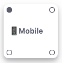
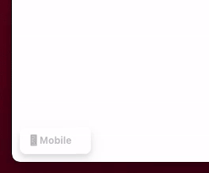

<h1 align="center">Welcome to React Breakpoint 👋</h1>
<p>
  
  <a href="https://github.com/imoby/react-breakpoint-widget#readme" target="_blank">
    
  </a>
  <a href="https://github.com/imoby/react-breakpoint-widget/graphs/commit-activity" target="_blank">
    
  </a>
  <a href="https://github.com/imoby/react-breakpoint-widget/blob/master/LICENSE" target="_blank">
    
  </a>
  <a href="https://twitter.com/imoby" target="_blank">
    
  </a>
</p>

> A react widget to help you view your breakpoints as you're developing and testing your app without having to use any dev tools



### 🏠 [Homepage](https://github.com/imoby/react-breakpoint-widget.git)

Setting this tool up is as easy as installing this dependency and passing in your breakpoints for your app. This is meant to ONLY be used in development mode so please make sure to add any checks for dev/prod when adding this widget.

## Preview



## Install

### Yarn

```console
$ yarn add -D react-breakpoint-widget
```

### Npm

```console
$ npm install -D react-breakpoint-widget
```

## Import

```jsx
import BreakpointWidget, { BreakPoint } from 'react-breakpoint-widget';
```

## Usage

```jsx
<div>
  {process.env.NODE_ENV === 'development' && (
    <BreakpointWidget breakPoints={breakpoints} />
  )}
</div>
```

## Example of breakpoints

### One thing to keep note of is that if you do not want a max breakpiont set on the last point, you can not set a maximum and it will automatically be taken care of.

```jsx
const breakpoints: BreakPoint[] = [
  {
    minWidth: 0,
    maxWidth: 300,
    label: '📱 MobileSmall',
  },
  {
    minWidth: 301,
    maxWidth: 600,
    label: '📱 Mobile',
  },
  {
    minWidth: 601,
    maxWidth: 800,
    label: '💻 Tablet',
  },
  {
    minWidth: 801,
    label: ' 🖥 Desktop',
  },
];
```

## API

### Props

| Prop Name       | Description                                                       |
| --------------- | ----------------------------------------------------------------- |
| breakPoints     | An array of breakpoints that follow the BreakPoint interface      |
| initialPosition | Position where the tool should be anchored to initially on screen |

## Author

👤 **Muhamed Brifkani**

- Website: muhamedbrifkani.com
- Twitter: [@imoby](https://twitter.com/imoby)
- Github: [@imoby](https://github.com/imoby)

## Show your support

Give a ⭐️ if this project helped you!

## 📝 License

Copyright © 2021 [Muhamed Brifkani](https://github.com/imoby).<br />
This project is [MIT](https://github.com/imoby/react-breakpoint-widget/blob/master/LICENSE) licensed.

---

_This README was generated with ❤️ by [readme-md-generator](https://github.com/kefranabg/readme-md-generator)_
